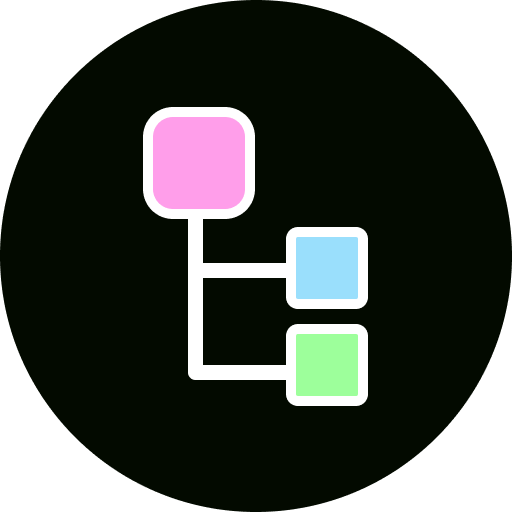

# TreeView

<p align="center">
  
</p>

[](https://www.codacy.com/gh/AmrDeveloper/TreeView/dashboard?utm_source=github.com&amp;utm_medium=referral&amp;utm_content=AmrDeveloper/TreeView&amp;utm_campaign=Badge_Grade)
[](https://www.codefactor.io/repository/github/amrdeveloper/treeview)
[]()


Multi Roots TreeView implementation for Android Platform with a lot of options and customization

## Demo
<p align="center">
  
  
  
</p>

### Features:
    - No Custom Views.
    - Easy use, customize and extend.
    - Support any number of roots.
    - Can use a different design for each node.
    - Selection mode for nodes.
    - Dynamic adding and removing nodes.
    - Don't save a reference for the view holder in each node.
    - Can handle a large number of nodes without problems.
    - Providing on click and on long click listener nodes.
    - Easy to override any operations by override `TreeNodeManager`.
    - Collapse and Extend node and node branch.
    - Collapse and extend nodes by level.
    - Collapse and expand all nodes.
    - Can perform 2D scrolling without custom layout.

### Documentations:
  - [Full Documentation](https://amrdeveloper.github.io/treeview/)
  - [Install Documentation](docs/install.md)
  - [Add to XML Documentation](docs/add-to-xml.md)
  - [ViewHolders Documentation](docs/view-holders.md)
  - [Tree Node Documentation](docs/treenode.md)
  - [TreeView Adapter Documentation](docs/treeview-adapter.md)
  - [TreeNode Manager Documentation](docs/treenode-manager.md)
  - [Full Example Documentation](docs/full-example.md)

### Articles
  - [A new Android TreeView implementation](https://itnext.io/a-new-android-treeview-implementation-9b27ca9854af)
  - [How to build TreeView from JSON in Android](https://itnext.io/how-to-build-treeview-from-json-in-android-9ec342a6205)

### License
```
MIT License

Copyright (c) 2022 Amr Hesham

Permission is hereby granted, free of charge, to any person obtaining a copy
of this software and associated documentation files (the "Software"), to deal
in the Software without restriction, including without limitation the rights
to use, copy, modify, merge, publish, distribute, sublicense, and/or sell
copies of the Software, and to permit persons to whom the Software is
furnished to do so, subject to the following conditions:

The above copyright notice and this permission notice shall be included in all
copies or substantial portions of the Software.

THE SOFTWARE IS PROVIDED "AS IS", WITHOUT WARRANTY OF ANY KIND, EXPRESS OR
IMPLIED, INCLUDING BUT NOT LIMITED TO THE WARRANTIES OF MERCHANTABILITY,
FITNESS FOR A PARTICULAR PURPOSE AND NONINFRINGEMENT. IN NO EVENT SHALL THE
AUTHORS OR COPYRIGHT HOLDERS BE LIABLE FOR ANY CLAIM, DAMAGES OR OTHER
LIABILITY, WHETHER IN AN ACTION OF CONTRACT, TORT OR OTHERWISE, ARISING FROM,
OUT OF OR IN CONNECTION WITH THE SOFTWARE OR THE USE OR OTHER DEALINGS IN THE
SOFTWARE.
```